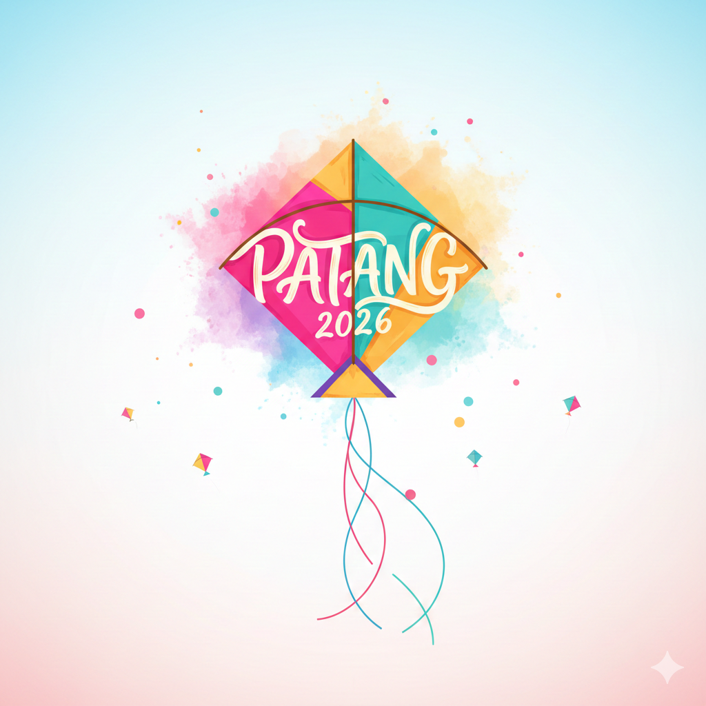
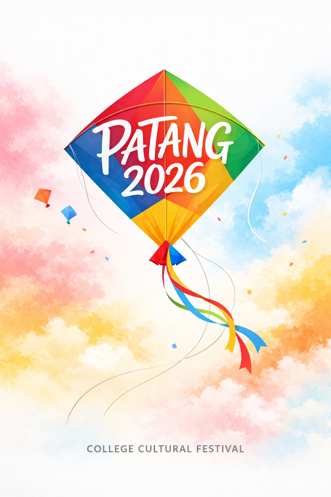
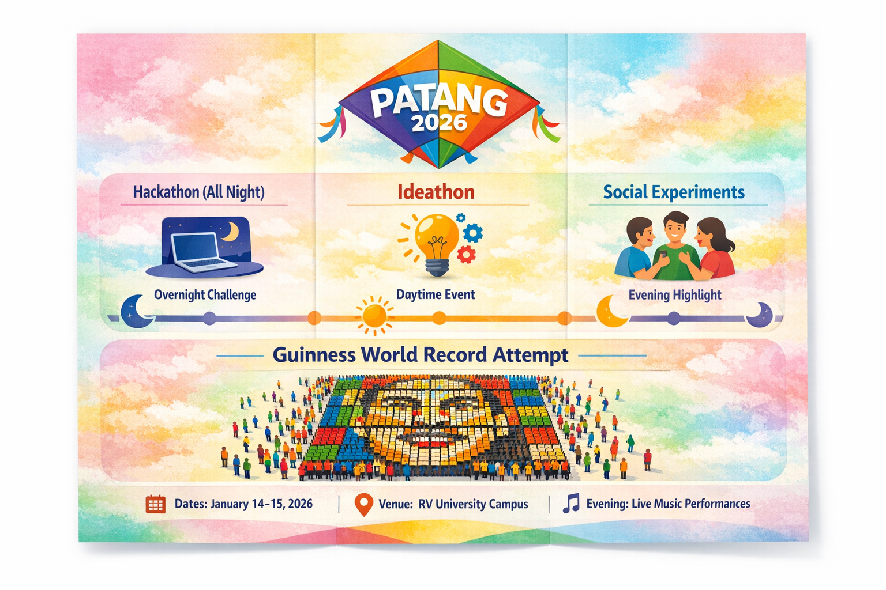

# Image Prompts

## Poster Prompt
A minimal yet festive event poster for a college cultural festival called “PATANG 2026”.

The words “PATANG 2026” are written inside a colorful kite, forming the actual body of the kite, with elegant hand-painted typography.

The kite is flying in the sky with soft strings flowing naturally.

Background has a Holi-inspired vibe — gentle clouds of powdered colors (pink, yellow, blue, orange) blending softly, not overwhelming.

Clean white-to-pastel sky background, bright daylight.

Subtle festive Indian elements like tiny kites in the distance and faint confetti.

Modern, youthful, college-fest aesthetic.

Flat illustration style with slight depth, smooth gradients, high resolution, poster-friendly layout.

No clutter, no crowd, simple composition, joyful and energetic mood.

### Generated Posters

## Brochure Prompt
A modern tri-fold style brochure design for a university cultural and tech fest called “PATANG 2026”.
Bright, festive yet clean layout inspired by kites and Holi colors.
Background uses soft pastel color splashes (pink, yellow, blue, green) with a light sky texture.

**Top section:**
A colorful kite graphic with the title “PATANG 2026” integrated into the kite design.

**Middle sections (clearly divided panels):**
Clean icon-based sections with headings and short descriptions:

Hackathon (All Night) – moon & laptop icon, night sky gradient

Ideathon – lightbulb & brainstorm icon

Social Experiments – people interaction icon

Guinness World Record Attempt – large group forming a Rubik’s Cube mosaic portrait, top-down view illustration

Each event has simple timing labels like:
“Overnight Challenge”
“Daytime Event”
“Evening Highlight”

**Bottom section:**
Event details displayed neatly:
Dates: January 14–15, 2026
Venue: RV University Campus
Evening: Live Music Performances
Minimal text, strong visual hierarchy, easy-to-read typography, modern college fest aesthetic.
Flat illustration style with soft shadows, smooth gradients, brochure-ready layout, high resolution.

**🧠 Optional Timing Emphasis Add-On**
Add this line if you want time flow to be visually clear:

Include a subtle timeline design flowing left to right or top to bottom, with sun and moon icons indicating day and night events.

**🎨 Style Control (Optional)**

Use rounded shapes, friendly icons, bold section headers, and plenty of white space.
Color palette inspired by Indian festivals but toned down for readability.

**🚫 Negative Prompt**

Avoid realistic people, avoid cluttered text, avoid dark backgrounds, avoid excessive fonts, no logos, no watermarks, no photo-realism.
Ensure the tri-fold brochure uses all three panels fully, with no empty or blank areas. Each panel should be visually balanced and completely filled with relevant design elements, illustrations, or sections.

### Generated Brochure

